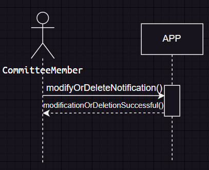
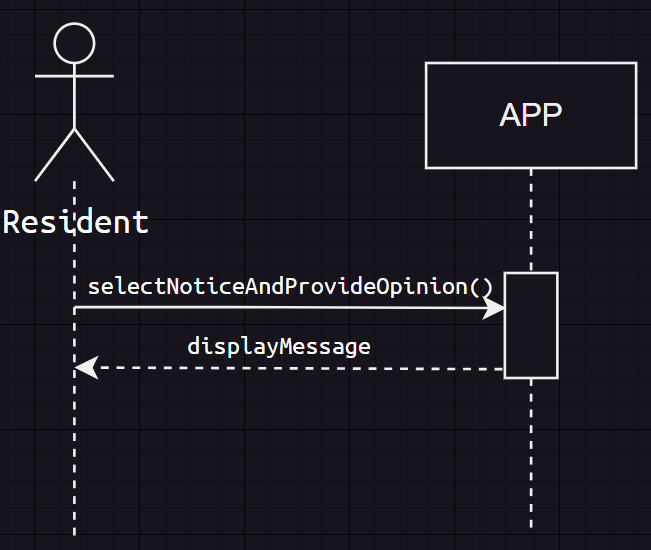

# 第4次作業-作業-HW4
>
>學號：111111102
> 
>姓名：張紘榤
> 
>作業撰寫時間：40 (mins，包含程式撰寫時間)
> 
>最後撰寫文件日期：2024/05/20
>

本份文件包含以下主題：(至少需下面兩項，若是有多者可以自行新增)
- [x] 說明內容
- [x] 個人認為完成作業須具備觀念

## 說明程式與內容
### a.  

### b.  
#### 1：  
  
操作：綁定手機APP確認個人資料  
交互參照：住戶向警衛提供個人資料綁定APP。  
前置條件：住戶已向警衛確認資料，登入APP並選擇綁定手機APP功能。  
後置條件：用戶的個人資料已被確認並成功綁定至APP。  
#### 2：  
  
操作：使用APP發布社區公告  
交互參照：委員通過APP提交公告內容。  
前置條件：委員已登入APP，並選擇發布社區公告功能。  
後置條件：社區公告已成功發布至系統。  
#### 3：  
  
操作：使用APP查詢社區公告  
交互參照：住戶通過APP查詢公告。  
前置條件：住戶已登入APP，並選擇查詢社區公告功能。  
後置條件：系統顯示相應的社區公告列表。  
#### 4：  
  
操作：使用APP修改或刪除公告  
交互參照：委員在APP上選擇公告並進行修改或刪除。  
前置條件：委員已登入APP，並修改或刪除社區公告。  
後置條件：委員已登入APP，並成功修改或刪除社區公告  
#### 5：  
  
操作：回應社區公告使用APP提供意見  
交互參照：住戶在APP上選擇特定的社區公告並提供意見。  
前置條件：住戶已使用APP選擇回應社區公告功能並提供意見。  
後置條件：系統確認已成功回應並顯示確認訊息給用戶。  

## 個人認為完成作業須具備觀念
初步類別圖和系統循序圖都是建立軟體系統設計的基礎  
繪畫初步類別圖要先找出類別與屬性，繪製系統循序圖要理解各個符號所代表的意思，也要多多觀察避免畫錯。
